# Code Review Board v1.0

## Compaction Recovery

If you're reading this after context compression, check for an active session:

1. Look for `~/.claude/.active-code-review-session`
2. If it exists, read `session-state.md` inside the session directory it points to
3. Validate the session lock file has not expired
4. Resume from the phase indicated in `session-state.md`

If no active session exists, start fresh.

## Overview

Orchestrates a team of expert reviewer agents who conduct a structured, multi-perspective code review using a blackboard architecture. Agents write structured JSON files to a shared session directory; the moderator polls for file existence, reads results, and writes all events to the JSONL log. Reviewers independently analyze code, debate contested findings in discussion rounds, and produce a severity-ranked findings list.

A reconnaissance phase (scout + research) gathers codebase context and current best practices before reviewers begin. This is unique to code-review — other Spectra skills do not have a pre-review intelligence-gathering phase.

Reviews operate in one of three cost tiers (Quick, Standard, Deep) auto-selected based on target size, with user override.

You (the main Claude instance) act as the **moderator** throughout. You drive every phase directly — there is no coordinator agent.

### Success Metrics

Track these outcome-based metrics in the cross-session manifest to measure whether reviews deliver value:

| Metric | How Measured | Target |
|---|---|---|
| **Findings-to-action rate** | Fraction of critical/major findings resulting in code changes (measured via follow-up review) | > 60% |
| **False-positive rate** | Findings dismissed via `i` during discussion | < 20% |
| **Session completion rate** | Sessions reaching synthesis without abort | > 90% |
| **User satisfaction** | Post-session "actionable?" yes rate | > 70% |

Metrics aggregated from manifest entries over rolling 30-day windows.

## Input

The user provides one of:

- **Diff mode**: Branch name or commit range. Scout gathers the diff plus surrounding context (unchanged lines around each hunk, related files, test coverage).
- **Module mode**: File or directory path. Scout gathers the module plus dependents and dependencies (imports, exports, callers, tests).

Detect which mode was provided and adapt accordingly.

## Process

```dot
digraph code_review {
    rankdir=TB;

    "Phase 0: Context preparation" [shape=box];
    "Gather project context" [shape=box];
    "Detect target mode (diff/module)" [shape=box];
    "Auto-select tier" [shape=box];
    "Select reviewers from roster" [shape=box];
    "Confirmation gate" [shape=box];
    "User confirms?" [shape=diamond];
    "Exit" [shape=doublecircle];
    "Setup: dir structure, session lock, sentinel" [shape=box];

    "Phase 1: Reconnaissance" [shape=box, style=bold];
    "Scout agent gathers context" [shape=box];
    "Scout produces context-bundle.json" [shape=box];
    "Quick tier?" [shape=diamond];
    "Research agent queries best practices" [shape=box];
    "Research produces research-brief.json" [shape=box];
    "Post-recon gate" [shape=box];
    "Show scout summary + research highlights" [shape=box];
    "User confirms roster?" [shape=diamond];

    "Phase 2: Opening Review" [shape=box, style=bold];
    "Spawn opus reviewer agents, poll for files" [shape=box];
    "Moderator reads findings, writes events" [shape=box];
    "Specialist recommendations?" [shape=diamond];
    "Show specialist to user + confirm" [shape=box];
    "Spawn specialist" [shape=box];
    "Extract topics from findings" [shape=box];

    "Phase 3: Discussion" [shape=box, style=bold];
    "Fresh agents debate findings per topic" [shape=box];
    "Moderator reads responses, writes events" [shape=box];
    "User: [Enter] advance | [i] dismiss | [w] wrap up" [shape=box];
    "Convergence or deadlock?" [shape=diamond];
    "Escalate to user" [shape=box];
    "Round limit hit?" [shape=diamond];

    "Phase 4: Final Positions" [shape=box, style=bold];
    "Spawn agents for final positions, poll" [shape=box];
    "Moderator produces synthesis-brief.json" [shape=box];

    "Phase 5: Synthesis" [shape=box, style=bold];
    "session_complete sentinel" [shape=box];
    "Shutdown team + TeamDelete" [shape=box];
    "Spawn synthesis agent" [shape=box];
    "Synthesis agent writes review-findings.md" [shape=box];
    "Post-synthesis directory audit" [shape=box];
    "Moderator writes session_end event" [shape=box];

    "Cleanup + feedback" [shape=doublecircle];

    "Phase 0: Context preparation" -> "Gather project context";
    "Gather project context" -> "Detect target mode (diff/module)";
    "Detect target mode (diff/module)" -> "Auto-select tier";
    "Auto-select tier" -> "Select reviewers from roster";
    "Select reviewers from roster" -> "Confirmation gate";
    "Confirmation gate" -> "User confirms?";
    "User confirms?" -> "Setup: dir structure, session lock, sentinel" [label="yes"];
    "User confirms?" -> "Exit" [label="cancel"];

    "Setup: dir structure, session lock, sentinel" -> "Phase 1: Reconnaissance";
    "Phase 1: Reconnaissance" -> "Scout agent gathers context";
    "Scout agent gathers context" -> "Scout produces context-bundle.json";
    "Scout produces context-bundle.json" -> "Quick tier?";
    "Quick tier?" -> "Post-recon gate" [label="yes (skip research)"];
    "Quick tier?" -> "Research agent queries best practices" [label="no"];
    "Research agent queries best practices" -> "Research produces research-brief.json";
    "Research produces research-brief.json" -> "Post-recon gate";
    "Post-recon gate" -> "Show scout summary + research highlights";
    "Show scout summary + research highlights" -> "User confirms roster?";
    "User confirms roster?" -> "Phase 2: Opening Review" [label="yes"];
    "User confirms roster?" -> "Select reviewers from roster" [label="adjust"];

    "Phase 2: Opening Review" -> "Spawn opus reviewer agents, poll for files";
    "Spawn opus reviewer agents, poll for files" -> "Moderator reads findings, writes events";
    "Moderator reads findings, writes events" -> "Specialist recommendations?";
    "Specialist recommendations?" -> "Show specialist to user + confirm" [label="yes"];
    "Specialist recommendations?" -> "Extract topics from findings" [label="no"];
    "Show specialist to user + confirm" -> "Spawn specialist";
    "Spawn specialist" -> "Extract topics from findings";
    "Extract topics from findings" -> "Quick tier skip?" [label=""];
    "Quick tier skip?" [shape=diamond];
    "Quick tier skip?" -> "Phase 5: Synthesis" [label="Quick (no discussion)"];
    "Quick tier skip?" -> "Phase 3: Discussion" [label="Standard/Deep"];

    "Phase 3: Discussion" -> "Fresh agents debate findings per topic";
    "Fresh agents debate findings per topic" -> "Moderator reads responses, writes events";
    "Moderator reads responses, writes events" -> "User: [Enter] advance | [i] dismiss | [w] wrap up";
    "User: [Enter] advance | [i] dismiss | [w] wrap up" -> "Convergence or deadlock?";
    "Convergence or deadlock?" -> "Phase 4: Final Positions" [label="converged"];
    "Convergence or deadlock?" -> "Escalate to user" [label="deadlock"];
    "Convergence or deadlock?" -> "Round limit hit?" [label="continue"];
    "Escalate to user" -> "Convergence or deadlock?";
    "Round limit hit?" -> "Phase 4: Final Positions" [label="yes"];
    "Round limit hit?" -> "Fresh agents debate findings per topic" [label="no"];

    "Phase 4: Final Positions" -> "Spawn agents for final positions, poll";
    "Spawn agents for final positions, poll" -> "Moderator produces synthesis-brief.json";
    "Moderator produces synthesis-brief.json" -> "Phase 5: Synthesis";

    "Phase 5: Synthesis" -> "session_complete sentinel";
    "session_complete sentinel" -> "Shutdown team + TeamDelete";
    "Shutdown team + TeamDelete" -> "Spawn synthesis agent";
    "Spawn synthesis agent" -> "Synthesis agent writes review-findings.md";
    "Synthesis agent writes review-findings.md" -> "Post-synthesis directory audit";
    "Post-synthesis directory audit" -> "Moderator writes session_end event";
    "Moderator writes session_end event" -> "Cleanup + feedback";
}
```

## Cost Tiers

| Tier | Scout | Research | Reviewers | Discussion Rounds | Output |
|---|---|---|---|---|---|
| **Quick** | 1 (sonnet) | Skip | 3-4 (opus) | 0 | Findings list |
| **Standard** | 1 (sonnet) | 1 (sonnet) | 5-6 (opus) | 1 | Findings list |
| **Deep** | 1 (sonnet) | 1 (sonnet) | 7-8 (opus) | 2 | Findings list |

### Model Allocation

| Agent | Model | Reasoning |
|---|---|---|
| Scout | sonnet | Judgment about relevance, not deep reasoning |
| Research | sonnet | Query formulation and summarization |
| Opening reviewers | opus | Nuanced code analysis — quality matters most |
| Discussion agents | opus | Argumentation and trade-off reasoning |
| Synthesis | sonnet | Structural work — ranking, formatting, dedup |

### Tier Auto-Selection

Auto-suggest based on target size:

| Criteria | Tier |
|---|---|
| Single file or < 200 lines changed | Quick |
| 200-1000 lines or 2-4 files | Standard |
| > 1000 lines or 5+ files | Deep |

User can always override at the confirmation gate.

## User Journey

Invocation: `/review [path-or-branch] [--tier quick|standard|deep]`

1. User runs the slash command with a target (file path, directory, or branch name) and an optional tier flag.
2. If no tier flag is provided, the moderator applies auto-selection based on the criteria above.
3. **Confirmation gate**: Moderator displays the target summary, detected technologies, proposed reviewer roster, and tier. Prompts the user for confirmation.
4. **Phase 1 (Reconnaissance)**: Scout and research agents gather context. After completion, the moderator shows the scout summary and research highlights at the **post-recon gate**. User confirms or adjusts the reviewer roster.
5. **Phase 2 (Opening Review)**: Reviewer agents independently analyze the code. Moderator processes findings and extracts discussion topics.
6. **Phase 3 (Discussion, Standard/Deep only)**: Between-round controls are presented to the user:
   - **Enter** = advance to next round
   - **`i`** = dismiss a finding (marks it as false positive)
   - **`w`** = wrap up discussion early and proceed to final positions
7. **Phase 4 (Final Positions, Standard/Deep only)**: Agents submit final severity assessments.
8. **Phase 5 (Synthesis)**: Moderator produces `review-findings.md` with severity-ranked findings.
9. **Post-session feedback**: Micro-survey — "Were these findings actionable?" (Yes/Somewhat/No).

## Security Model

See `~/.claude/skills/shared/security.md` for the complete security model.

### Agent Permissions

| Agent Role | subagent_type | mode | Rationale |
|---|---|---|---|
| Scout agent | `general-purpose` | `bypassPermissions` | Must write context-bundle.json to session directory |
| Research agent | `general-purpose` | `bypassPermissions` | Must write research-brief.json to session directory |
| Review agents | `general-purpose` | `bypassPermissions` | Must write JSON output files to session directory |
| Synthesis agent | `general-purpose` | `bypassPermissions` | Must write review-findings.md to session directory |

All agents run with `bypassPermissions` because they need file-write access. Security is enforced at the prompt and audit layers, not the platform permission layer.

### WebSearch Trust Boundary

WebSearch is a **Layer 4 trust boundary** for the research agent. Mitigations:

- **Provenance tagging**: All web-sourced content is tagged with source URL and retrieval timestamp in `research-brief.json`.
- **Domain scoping**: Research queries are scoped to known authoritative sources (official docs, RFCs, language specs).
- **Content isolation**: Web-sourced content is wrapped in randomized delimiters before injection into reviewer prompts. See `~/.claude/skills/shared/security.md` for the delimiter pattern.
- **Query constraints**: Research agent prompts constrain queries to factual best-practice lookups. No arbitrary web browsing.

### Scout Read Boundaries

The scout agent has explicit read-boundary constraints:

- **Allowed**: Project directory and its subdirectories (the codebase under review)
- **Denied**: Dotfiles and dot-directories (`.env`, `.git/`, `.claude/`, etc.)
- **Denied**: Files outside the project directory
- **Enforcement**: Prompt-level path constraints + post-phase directory audit

### Content Isolation

User-provided code is delivered to agents using **file-path reference by default** rather than inline content injection. The agent prompt includes file paths and instructions to read the code, rather than embedding the full content in the prompt. This reduces the injection surface area by keeping code content out of the prompt itself.

**Fallback for pasted text**: When the user pastes code directly (no file path), wrap in randomized delimiters before injection into agent prompts. See `~/.claude/skills/shared/security.md` for the delimiter pattern.

## Context Management

Read `~/.claude/skills/shared/orchestration.md` for the blackboard protocol. This covers:

- Session directory structure
- Agent prompt template (base)
- Agent spawning conventions
- Polling protocol and timeouts
- JSONL single-writer semantics
- Synthesis pipeline
