# Deep Design Review Board v4.0

## Overview

Orchestrates a team of expert agents who conduct a structured, multi-perspective design review using a blackboard architecture. Agents write structured JSON files to a shared session directory; the moderator polls for file existence, reads results, and writes all events to the JSONL log. Agents review independently, engage in topic-threaded discussion, and produce a revised document — all within bounded time.

Reviews operate in one of three cost tiers (Quick, Standard, Deep) auto-selected based on document complexity, with user override.

You (the main Claude instance) act as the **moderator** throughout. You drive every phase directly — there is no coordinator agent.

### Success Metrics

Track these outcome-based metrics in the cross-session manifest to measure whether reviews deliver value:

| Metric | How Measured | Target |
|---|---|---|
| **Findings acted on %** | Collected at next invocation via follow-up prompt (see Post-Review Feedback) | > 50% of critical/major findings acted on |
| **Repeat usage rate** | Sessions per user per week from manifest | Sustained or growing over time |
| **Helpful rating %** | Micro-survey at session end (see Post-Review Feedback) | > 70% rated "Very" or "Somewhat" helpful |
| **Session completion rate** | `session_end` events with quality != failure / total sessions | > 90% |

## Input

The user provides one of:
- **File path(s)**: One or more document files to review
- **Pasted text**: Document content pasted directly in conversation

Detect which type was provided and adapt accordingly.

## Process

```dot
digraph deep_design {
    rankdir=TB;
    "Phase 0: Context preparation" [shape=box];
    "Gather project context" [shape=box];
    "Read + classify document" [shape=box];
    "Auto-select tier" [shape=box];
    "Select agents from matrix" [shape=box];
    "Confirmation gate" [shape=box];
    "User confirms?" [shape=diamond];
    "Setup: dir structure, team, agent prompts" [shape=box];
    "Opening Round: spawn agents, poll for files" [shape=box];
    "Moderator reads agent files, writes events" [shape=box];
    "System recommends specialists?" [shape=diamond];
    "Show specialist to user + confirm" [shape=box];
    "Spawn specialist" [shape=box];
    "Extract topics, present to user" [shape=box];
    "Discussion: fresh agents per round, poll" [shape=box];
    "Moderator reads files, writes events" [shape=box];
    "User: [Enter] Continue | [i] Inject context | [w] Wrap up" [shape=box];
    "Convergence reached?" [shape=diamond];
    "Escalate to user" [shape=box];
    "Round limit hit?" [shape=diamond];
    "Final Positions: spawn agents, poll" [shape=box];
    "Moderator produces synthesis-brief.json" [shape=box];
    "session_complete sentinel" [shape=box];
    "Shutdown team + TeamDelete" [shape=box, style=bold];
    "Spawn 2 parallel synthesis agents" [shape=box];
    "doc-revision agent writes revised-document.md" [shape=box];
    "log-generation agent writes discussion-log.md" [shape=box];
    "Post-synthesis directory audit" [shape=box];
    "Moderator writes session_end event" [shape=box];
    "Present summary + feedback + cleanup" [shape=doublecircle];

    "Phase 0: Context preparation" -> "Gather project context";
    "Gather project context" -> "Read + classify document";
    "Read + classify document" -> "Auto-select tier";
    "Auto-select tier" -> "Select agents from matrix";
    "Select agents from matrix" -> "Confirmation gate";
    "Confirmation gate" -> "User confirms?";
    "User confirms?" -> "Setup: dir structure, team, agent prompts" [label="yes"];
    "User confirms?" -> "Present summary + feedback + cleanup" [label="cancel"];
    "Setup: dir structure, team, agent prompts" -> "Opening Round: spawn agents, poll for files";
    "Opening Round: spawn agents, poll for files" -> "Moderator reads agent files, writes events";
    "Moderator reads agent files, writes events" -> "System recommends specialists?";
    "System recommends specialists?" -> "Show specialist to user + confirm" [label="yes"];
    "System recommends specialists?" -> "Extract topics, present to user" [label="no"];
    "Show specialist to user + confirm" -> "Spawn specialist";
    "Spawn specialist" -> "Extract topics, present to user";
    "Extract topics, present to user" -> "Discussion: fresh agents per round, poll";
    "Discussion: fresh agents per round, poll" -> "Moderator reads files, writes events";
    "Moderator reads files, writes events" -> "User: [Enter] Continue | [i] Inject context | [w] Wrap up";
    "User: [Enter] Continue | [i] Inject context | [w] Wrap up" -> "Convergence reached?";
    "Convergence reached?" -> "Final Positions: spawn agents, poll" [label="yes"];
    "Convergence reached?" -> "Escalate to user" [label="deadlock"];
    "Convergence reached?" -> "Round limit hit?" [label="no"];
    "Escalate to user" -> "Convergence reached?";
    "Round limit hit?" -> "Final Positions: spawn agents, poll" [label="yes"];
    "Round limit hit?" -> "Discussion: fresh agents per round, poll" [label="no"];
    "Final Positions: spawn agents, poll" -> "Moderator produces synthesis-brief.json";
    "Moderator produces synthesis-brief.json" -> "session_complete sentinel";
    "session_complete sentinel" -> "Shutdown team + TeamDelete";
    "Shutdown team + TeamDelete" -> "Spawn 2 parallel synthesis agents";
    "Spawn 2 parallel synthesis agents" -> "doc-revision agent writes revised-document.md";
    "Spawn 2 parallel synthesis agents" -> "log-generation agent writes discussion-log.md";
    "doc-revision agent writes revised-document.md" -> "Post-synthesis directory audit";
    "log-generation agent writes discussion-log.md" -> "Post-synthesis directory audit";
    "Post-synthesis directory audit" -> "Moderator writes session_end event";
    "Moderator writes session_end event" -> "Present summary + feedback + cleanup";
}
```



## Cost Tiers

| Tier | Agents | Discussion Rounds | Estimated Time | Use Case | Output Format |
|---|---|---|---|---|---|
| **Quick** | 3-4 | 0 (no discussion) | 1-3 min | Small docs, drafts, quick sanity checks | Prioritized checklist |
| **Standard** | 6-8 | 1 round | 5-10 min | Most design docs, architecture specs | Revised document |
| **Deep** | 10-15 | 2-3 rounds | 10-20 min | Complex architecture, critical systems | Revised document |

### Quick Tier: Design Doc Lint Pass

The Quick tier is positioned as a **fast design doc lint pass** — the lowest-friction entry point to the review system. It trades depth for speed and cost.

**Quick tier differences from Standard/Deep:**
- **No discussion phase**: Agents submit independent reviews only — no topic threading or rebuttals
- **Output format**: Prioritized checklist (not a full revised document). Format:
  ```
  ## Design Review Checklist

  ### Critical
  - [ ] {finding} — {agent}
  - [ ] {finding} — {agent}

  ### Major
  - [ ] {finding} — {agent}

  ### Minor
  - [ ] {finding} — {agent}

  ### Strengths
  - {positive observation} — {agent}
  ```
- **No specialists**: Quick tier does not support specialist recommendations
- **No between-round prompts**: Runs fully hands-off from confirmation to output

### Tier Auto-Selection

Auto-suggest based on document complexity:
- **Quick**: Under 3K tokens, or product spec without auth/data concerns
- **Standard**: 3K-15K tokens, or technical architecture docs
- **Deep**: Over 15K tokens, full design docs, or documents touching security/infrastructure

User can always override at the confirmation gate.

### Cost Optimization Strategies

- Discussion pruning/summarization between rounds (moderator produces condensed round summaries instead of raw context)
- Consensus-based early termination — skip further discussion on topics with broad agreement
- Lazy agent activation in Deep tier — start with core agents, activate specialists only if core reviews flag issues in their domain

## Security Model

See `~/.claude/skills/shared/security.md` for the complete security model.

### Agent Permissions

| Agent Role | subagent_type | mode | Rationale |
|---|---|---|---|
| Review agents | `general-purpose` | `bypassPermissions` | Must write JSON output files to session directory |
| Synthesis agents | `general-purpose` | `bypassPermissions` | Must write synthesis output files |

All agents run with `bypassPermissions` because they need file-write access. Security is enforced at the prompt and audit layers, not the platform permission layer.

### Content Isolation

User-provided documents are delivered to agents using **file-path reference by default** rather than inline content injection. The agent prompt includes a file path and instructions to read the document, rather than embedding the full content in the prompt. This reduces the injection surface area by keeping document content out of the prompt itself.

**Fallback for pasted text**: When the user pastes document content directly (no file path), wrap in randomized delimiters before injection into agent prompts. See `~/.claude/skills/shared/security.md` for the delimiter pattern.

## Context Management

Read `~/.claude/skills/shared/orchestration.md` for the blackboard protocol. This covers:
- Session directory structure
- Agent prompt template (base)
- Agent spawning conventions
- Polling protocol and timeouts
- JSONL single-writer semantics
- Synthesis pipeline
- Fault tolerance
- Session lock and stale detection
- JSONL utilities

The moderator drives all phases directly. Agents write structured JSON files to the session directory; the moderator polls for their existence, reads them, and writes corresponding events to the JSONL log.

## Phase 0: Context Preparation

If the conversation has prior history before this skill invocation, recommend the user run `/compact` first to maximize available context for the review session:

```
This review session works best with a clean context window.
Recommend running /compact before proceeding.
Continue anyway? [Y/n]
```

Skip this if the conversation is fresh (no prior messages).

## Phase 1: Project Context, Classification & Tier Selection

### Gather Project Context

Before classifying the document, read available project context:
- Read `CLAUDE.md` if it exists in the working directory or project root
- Detect project type from manifest files (package.json, Cargo.toml, pyproject.toml, go.mod, docker-compose.yml, etc.)
- Extract relevant conventions, tech stack, and patterns

This context is injected into every agent's prompt so reviews are project-aware.

### Classify the Document

Read the input and classify it as one of:
- **Product spec**: PRD, feature design, user stories — focuses on WHAT and WHY
- **Technical architecture**: System design, API spec, data model — focuses on HOW
- **Full design doc**: Covers both product and technical aspects

### Auto-Select Tier

Based on document complexity:
- Count tokens (approximate from character count)
- Analyze document structure (sections, diagrams, API definitions)
- Apply tier rules (see Cost Tiers section above)

### Select Agents

Use this matrix based on classification and tier:

| Agent | Product Spec | Tech Arch | Full Design |
|---|:---:|:---:|:---:|
| Principal PM | Yes | - | Yes |
| Principal Product Designer | Yes | - | Yes |
| Principal Frontend Engineer | If UI-related | Yes | Yes |
| Principal Backend Engineer | - | Yes | Yes |
| Security Expert | If auth/data | Yes | Yes |
| QA Expert | Yes | Yes | Yes |
| CEO/Strategist | Yes | - | Yes |
| DevOps/Infrastructure | - | Yes | Yes |
| System Architect | - | Yes | Yes |
| Data/Analytics Engineer | If metrics matter | If data-heavy | Yes |

**Hard limits**: Minimum 3 agents. Maximum 10 core + 5 specialists = 15.

**Tier-specific limits**:
- Quick: 3-4 agents, no specialists
- Standard: 6-8 agents, up to 2 specialists
- Deep: 10-15 agents, up to 5 specialists

### Confirmation Gate

Before spawning, present a structured confirmation prompt:

```
--- Deep Design Review ---

Document: {path} ({type}, {token_count} tokens)
Suggested tier: {tier}

Panel ({count} agents):
  - {Agent 1}     — {1-line rationale}
  - {Agent 2}     — {1-line rationale}
  ...

Estimated time: {time_range}
Discussion: {round_count} round(s)

[Enter] Accept  |  [q]uick / [s]tandard / [d]eep  |  [c]ustomize  |  [x] Cancel
```

Use `AskUserQuestion` to present this. User can switch tiers, customize the agent panel, or cancel before any cost is incurred.

Wait for user confirmation before proceeding.

### Input Validation

All user-facing prompts (`AskUserQuestion` calls) must handle input robustly:
- **Case-insensitive matching**: `W`, `w`, `wrap`, and `Wrap` all trigger wrap-up
- **First-character shortcut**: Match on the first character of the input against defined shortcuts
- **Unrecognized input**: Re-display the prompt with a hint: `Unrecognized input. Options: [Enter] Accept | [q]uick | ...`
- **Empty input (Enter)**: Always mapped to the default/continue action

## Phase 2: Team Setup

### Create the Team

```
TeamCreate: deep-design-{topic}-{timestamp}
```

Include a timestamp to ensure uniqueness across sessions.

### Create Session Directory

Create a namespaced session directory with subdirectories for agent output:

```
~/.claude/deep-design-sessions/{topic}-{timestamp}/
  session.lock           # Lock file with TTL
  review-events.jsonl    # JSONL event log (moderator-only writer)
  synthesis-brief.json   # Structured synthesis brief (produced by moderator)
  topics.json            # Discussion topics (written by moderator)
  opening/               # Agent opening-round outputs
    {agent-name}.json
  discussion/            # Agent discussion responses (per round)
    round-{n}/
      {agent-name}.json
  final-positions/       # Agent final recommendations
    {agent-name}.json
  discussion-log.md      # Human-readable review log (generated at synthesis)
  revised-document.md    # The revised document (or checklist for Quick tier)
```

### Lock File

Create `session.lock` with tier-appropriate TTL:
```json
{
  "session_id": "deep-design-{topic}-{timestamp}",
  "pid": 12345,
  "started_at": "ISO-8601",
  "ttl_minutes": 30,
  "tier": "standard"
}
```

TTL values per tier:
- Quick: 15 minutes
- Standard: 30 minutes
- Deep: 60 minutes

### Write Session Start Event

The moderator writes the `session_start` event directly to `review-events.jsonl`:

```jsonl
{"event_id":"uuid","sequence_number":1,"schema_version":"1.0.0","type":"session_start","timestamp":"ISO-8601","session_id":"deep-design-{topic}-{timestamp}","agents":["fe-engineer","be-engineer",...],"document":"path/to/doc","stack":"Next.js + TypeScript","document_type":"full_design","tier":"standard"}
```

### Build Agent Prompts

Build agent prompts using the base template from `~/.claude/skills/shared/orchestration.md`, with deep-design-specific task content (see Phase 3 for the opening round template).

**IMPORTANT**: Validate that each persona file exists at `~/.claude/skills/deep-design/personas/{role}.md` before spawning. Fail fast with a clear error if missing.

### Spawn Review Agents

For each selected agent, spawn using the Agent tool with:
- `team_name`: the team name
- `name`: the agent's role name (e.g., "fe-engineer", "security-expert")
- `subagent_type`: "general-purpose"
- `mode`: "bypassPermissions"
- `max_turns`: 20
- `run_in_background`: true
- `prompt`: Persona + project context + task (see opening round template below)

### Show Progress

```
[1/5] Setting up review...
      {agent count} agents spawning ({tier} tier)
```

## Phase 3: Opening Round

The moderator drives this phase directly:

1. **Spawn all review agents in parallel**, each instructed to write their review to `opening/{agent-name}.json`
2. **Poll `opening/*.json` using Glob** every ~10 seconds
3. **When all files arrive** (or timeout at 120s): read each file, write `review` and `agent_complete` events to the JSONL log
4. **Post-phase directory audit**: Snapshot the session directory before and after the phase. Any unexpected files are flagged as a `security_violation` event.
5. **Analyze reviews** for discussion topics — extract disagreements and major concerns into named topics
6. **Write topics** to `topics.json`
7. **Present summary to user** with interactive options

### Opening Round Agent Prompt Template

```
{persona file contents}

## Project Context
{CLAUDE.md conventions}
{Detected stack}

## Your Task
Review the document from your perspective.

Write your review as a JSON file to:
  `{session_directory}/opening/{your-agent-name}.json`

Schema:
{
  "agent": "{your-agent-name}",
  "observations": [
    {"text": "...", "severity": "critical|major|minor", "id": "obs-{uuid}"}
  ],
  "recommendations": ["..."],
  "specialist_recommendation": null | {"specialist": "name", "justification": "..."}
}

## Rules
- Write ONLY to the path above — do not create any other files
- Use python3 for JSON serialization: python3 -c "import json; ..."
- Read the document at: {document_file_path}
- After writing your file, you are done — do not wait for further instructions
```

### Specialist Recommendations

During the opening round, the system may recommend additional domain specialists based on findings. **Trigger criteria**:
- **Automatic trigger**: 2 or more agents flag observations in the same domain concern area (e.g., two agents mention HIPAA, two agents flag distributed systems concerns)
- **Domain gap detection**: The moderator identifies a topic area with critical/major findings but no agent with matching expertise on the panel
- **Maximum recommendations per session**: 3 (to limit mid-review scope creep)

When a specialist recommendation triggers:

1. **Check pre-built specialists first**: Look in `~/.claude/skills/deep-design/personas/specialists/` for a matching template
2. **If pre-built exists**: Show the user the specialist name and focus area. Ask for confirmation.
3. **If custom specialist needed**: Generate a full persona using the specialist template (see Dynamic Specialists section below). Show the generated persona to the user for approval.
4. **If approved**: Spawn the specialist as a `general-purpose` agent with `bypassPermissions`. Include them in the discussion phase.
5. **Maximum 5 specialists per session** (Quick: 0, Standard: 2, Deep: 5).

Show progress (append-only, not in-place updates):
```
[2/5] Opening round — collecting initial reviews...
      [FE Engineer] review complete (3 critical, 2 major)
      [System Architect] review complete (1 critical, 4 major)
      ...
      6/7 agents complete | Specialist recommended: HIPAA Compliance
      Approve specialist? [Y/n]
```

## Phase 4: Topic-Threaded Discussion

**Skip entirely for Quick tier** (0 rounds).

### Extract Topics

After the opening round, extract disagreements and major concerns into named topics:
```
Topic T001: {title} — raised by {agent}, relevant to {agents}
Topic T002: {title} — raised by {agent}, relevant to {agents}
```

Assign agents to topics based on their Natural Collaborators and the topic's domain.

### Run Discussion

The moderator drives discussion directly using fresh agents per round:

1. **Moderator writes `topics.json`** with assigned agents per topic
2. **For each round**, moderator creates `discussion/round-{n}/` directory
3. **Spawn fresh agents** with:
   - Topics they're assigned to
   - Relevant positions from previous rounds (extracted from prior round files)
   - Instruction to write `discussion/round-{n}/{agent-name}.json`
4. **Poll for files** using Glob every ~10 seconds
5. **Read results**, write `rebuttal`/`pass` events to the JSONL log
6. **Resolve topics**: check convergence, write `topic_resolved` events
7. **Present round summary to user**

### Discussion Agent Prompt Template

```
{persona file contents}

## Discussion Context
You are participating in round {n} of the design review discussion.

### Topics assigned to you:
{topics with their current state}

### Positions from other reviewers:
{relevant positions extracted from previous round files}

## Your Task
Respond to each assigned topic with your position.

Write your response as a JSON file to:
  `{session_directory}/discussion/round-{n}/{your-agent-name}.json`

Schema:
{
  "agent": "{your-agent-name}",
  "responses": [
    {
      "topic_id": "T001",
      "type": "rebuttal | pass",
      "position": "Your substantive response (if rebuttal)",
      "round": {n}
    }
  ]
}

## Rules
- Write ONLY to the path above — do not create any other files
- Use python3 for JSON serialization: python3 -c "import json; ..."
- After writing your file, you are done — do not wait for further instructions
```

### Between-Round User Prompt

After each round, the moderator presents the summary to the user with:

```
{round summary}

[Enter] Continue | [i] Inject context | [w] Wrap up
```

- **Enter**: Proceed to the next discussion round (or to convergence if this was the final round)
- **i**: Inject additional context — the moderator prompts for free-form text input and includes it in the next round's agent prompts
- **w**: Trigger early termination — skip remaining rounds, collect final positions, proceed to synthesis

**Inactivity timeout**: If the user does not respond within 5 minutes at any blocking prompt (between-round, escalation, confirmation), the moderator auto-saves partial results and terminates the session cleanly with a `timeout` trigger.

**Maximum discussion rounds**: Quick (0), Standard (1), Deep (3).

Show progress (append-only):
```
[3/5] Discussion — resolving open topics...
      Round 1/1 | 4 topics open
      [T001] API pagination — 3/4 agents responded
      [T002] JSONL integrity — 4/4 agents responded, converging
      [T003] Cost model — 2/4 agents responded...
      Round 1/1 complete | 3 resolved, 1 deferred
```

### Escalation Protocol

When the moderator detects a deadlock on a topic:
1. Present both positions (concise) to the user:
```
--- Escalation: T002 — {title} ---

{Agent 1}: "{position}"
{Agent 2}: "{position}"

What should we do?
[1] {option 1}
[2] {option 2}
[3] Defer to v2
[s] Skip — let agents continue discussing
[f] Free-form — type your own resolution
```
2. If user selects `[f]`, prompt for free-form text input
3. User decides
4. Moderator writes `escalation_resolved` event and includes the decision in the next round's context

### Early Termination

User can type "wrap it up" (or select `[w]` at the between-round prompt) during the discussion phase to trigger immediate convergence. The moderator:
1. Writes a `phase_transition` event with trigger `user_abort`
2. Skips remaining discussion rounds
3. Collects whatever final positions are available
4. Proceeds directly to synthesis from current data

## Session State Machine

The review session follows a 4-state machine driven by the moderator:

```
COLLECTING ──(quorum_met)──► DISCUSSING ──(convergence_trigger)──► CONVERGING ──(synthesis_done)──► TERMINATED
     │                            │                                      │
     └─────(timeout/error)────────┴──────────(timeout/error)─────────────┴───► TERMINATED
```

**States:**
- **COLLECTING**: Agents submitting independent opening reviews (writing files)
- **DISCUSSING**: Topic-threaded discussion rounds in progress (fresh agents per round)
- **CONVERGING**: All convergence criteria met; collecting final positions and triggering synthesis
- **TERMINATED**: Session complete (normal or abnormal)

**Transitions** are typed `phase_transition` events in the JSONL log with `from`, `to`, and `trigger` fields.

### Convergence

Convergence triggers when ANY of (evaluated in priority order):
1. User requests early termination ("wrap it up" or `[w]` at between-round prompt) — trigger: `user_abort`
2. Round counter reaches the hard ceiling (tier-dependent: 0/1/3) — trigger: `round_limit`
3. All topics are in state `resolved`, `escalated`, or `deferred` — trigger: `all_topics_resolved`
4. All active agents send an explicit `pass` event for all open topics in the same round — trigger: `all_pass`

When multiple triggers fire in the same evaluation cycle, use the highest-priority trigger.

## Phase 5: Synthesis

Once discussion concludes:

1. **Spawn final-position agents** in parallel, each instructed to write to `final-positions/{agent-name}.json`. Poll for files, read results, write `final_position` events.

2. **Moderator produces `synthesis-brief.json`** directly — a structured summary containing all review observations grouped by severity, discussion resolutions per topic, final positions per agent, and session metrics:

```json
{
  "session_id": "{session_id}",
  "document_path": "path/to/original/doc",
  "tier": "{tier}",
  "agent_count": 7,
  "observations": {
    "critical": [{"agent": "...", "text": "...", "id": "obs-uuid"}],
    "major": [{"agent": "...", "text": "...", "id": "obs-uuid"}],
    "minor": [{"agent": "...", "text": "...", "id": "obs-uuid"}]
  },
  "topics": [
    {
      "id": "T001",
      "title": "...",
      "status": "resolved|deferred|escalated",
      "resolution": "...",
      "participants": ["agent1", "agent2"]
    }
  ],
  "final_positions": {
    "agent-name": ["rec1", "rec2", "rec3"]
  },
  "metrics": {
    "agents_active": 7,
    "agents_timed_out": 0,
    "topics_total": 4,
    "topics_resolved": 3,
    "topics_escalated": 1,
    "topics_deferred": 0,
    "quality": "Full|Partial|Minimal"
  }
}
```

3. **Write `session_complete` sentinel** to the JSONL event log with `final_sequence_number` set to the sentinel's own sequence number.

4. **TeamDelete** — shut down the review team.

5. **Spawn 2 parallel standalone synthesis agents** (`general-purpose`, `mode: "bypassPermissions"` — standalone subagents, NOT team members):

   **doc-revision agent** (default model) receives:
   - The original document path
   - The session directory path (to read `synthesis-brief.json` and `review-events.jsonl`)
   - The `jsonl-utils.sh` path (for querying events)
   - The `event-schemas.md` path (for understanding event types)
   - Key discussion resolutions that MUST be reflected in the revised document
   - The selected tier (to determine output format — checklist for Quick, revised doc for Standard/Deep)
   - Instructions to:
     a. Validate `session_complete` sentinel exists using `bash {jsonl_utils_path} has-sentinel`
     b. Read `synthesis-brief.json` as the primary input, with `review-events.jsonl` for full context where needed
     c. Produce `revised-document.md` with change attribution (or prioritized checklist for Quick tier)
     d. Return ONLY a short change summary (~15 lines max) listing what changed, who drove it, and severity

   **log-generation agent** (`model: "sonnet"`) receives:
   - The session directory path (to read `synthesis-brief.json` and `review-events.jsonl`)
   - The `event-schemas.md` path (for understanding event types)
   - Instructions to:
     a. Read `synthesis-brief.json` and `review-events.jsonl`
     b. Generate `discussion-log.md` from the data (human-readable narrative format)
     c. Return a brief confirmation with log stats (topic count, agent count, round count)

   Both agents run in parallel.

6. **Post-synthesis directory audit**: After both synthesis agents complete, the moderator validates the session directory against the file-write allowlist:
   - **Allowed files**: `review-events.jsonl`, `synthesis-brief.json`, `topics.json`, `session.lock`, `revised-document.md`, `discussion-log.md`
   - **Allowed directories and contents**: `opening/*.json`, `discussion/round-*/*.json`, `final-positions/*.json`
   - Any unexpected file triggers a `security_violation` event and user warning
   - Offending files are NOT included in the final output presentation

7. **Write `session_end` event** to `review-events.jsonl` with final metrics (quality computed per formula in event-schemas.md, using metrics from the synthesis brief and synthesis agents' return summaries).

8. **Present to user** using the appropriate terminal state message:

### Terminal State UX Messages

**All Clear** (zero critical/major findings):
```
Review complete — clean bill of health.

{agent_count} agents reviewed your document and found no critical or major issues.
{minor_count} minor suggestions are included in the revised document.

Files: {file paths}
```

**Findings Only** (findings exist, no escalations):
```
Review complete — {critical_count} critical, {major_count} major, {minor_count} minor findings.

## Executive Summary
{3-5 sentences}

## Changes ({count}):
1. {change} — raised by {agent} [{severity}]
...

## Action Items
- {item}

Files: {file paths}
```

**With Escalations** (user resolved escalations during review):
```
Review complete — includes {escalation_count} user-resolved escalation(s).

{findings output as above}

## User Decisions
- T00X: {user's decision}

Files: {file paths}
```

**Partial Failure** (some agents lost, quality < Full):
```
Review complete with reduced coverage ({quality} quality).

{active_count}/{total_count} agents completed their reviews.
{lost_agents} did not respond.

{findings output as above}

Files: {file paths}
```

**Full Failure** (below quorum):
```
Review could not be completed.

{error description}
Partial data has been saved to: {session_directory}

Recommended: retry the review with `/deep-design {document_path}`
```

9. **Collect feedback** (see Post-Review Feedback below).

### Post-Review Feedback

After presenting results, prompt the user with a structured micro-survey:

```
Quick feedback on this review:

1. Overall helpfulness?  [1] Very  [2] Somewhat  [3] Not helpful
2. Which findings were most valuable? (list numbers, or "none")
3. Anything missing or noisy? (free text, or "skip")
```

Store the response as a `feedback` event in JSONL with structured fields:
```json
{
  "type": "feedback",
  "helpfulness": 1,
  "valuable_findings": ["obs-id-1", "obs-id-2"],
  "user_comment": "Missing accessibility review"
}
```

Summarize in the cross-session manifest. At the next invocation of the same document (or any invocation after 3+ sessions), prompt for acted-on data:
```
Last review of {document} found {n} critical/major findings. How many did you act on? [number/skip]
```

Show progress:
```
[4/5] Collecting final positions...
[5/5] Synthesizing revised document...
      doc-revision agent: writing revised-document.md
      log-generation agent: writing discussion-log.md
      Done.
```

### Output Format

Output format for the revised document:

1. **Executive summary** (3-5 sentences) at the top
2. **Findings sorted by severity** (critical -> major -> minor), deduplicated across agents
3. **Action items** — concrete next steps extracted from recommendations
4. **Change attribution** — each change traces to the agent and observation that drove it
5. **Unresolved tensions** — any escalations or deferred topics

## Phase 6: Cleanup

Team teardown (TeamDelete) already happened in Phase 5 step 4. This phase handles remaining cleanup.

1. **This phase MUST run even on errors** — wrap in try/finally equivalent
2. Synthesis agents (standalone, no team context) terminate automatically when done
3. Remove the `session.lock` file
4. Write an entry to the cross-session manifest (see below)

### Cross-Session Manifest

Append one entry per session to `~/.claude/deep-design-sessions/manifest.jsonl`. Schema is defined in `~/.claude/skills/deep-design/event-schemas.md`.

This enables historical tracking and informed tier suggestions at the confirmation gate.

**Manifest size management**: At write-time, check the manifest file size. If it exceeds **500KB or 1000 entries**, truncate the oldest entries to stay within bounds and log a warning. This prevents unbounded filesystem growth while preserving the most recent historical data.

### Stale Session Detection

On invocation, check for stale lock files in session directories (TTL expired). Also check if a `deep-design-*` team already exists from a previous failed run. If found, clean up before proceeding.

Stale sessions are detected by TTL expiration in the lock file, not by PID checking (PIDs are unreliable across restarts).

## Dynamic Specialists

### Pre-Built Specialists

Pre-built specialist templates live in `~/.claude/skills/deep-design/personas/specialists/`. These have the same depth and quality as core bench personas. Available specialists:

- `hipaa-compliance.md` — Healthcare/HIPAA compliance
- `pci-dss.md` — Financial/PCI-DSS compliance
- `ml-engineer.md` — ML/AI Engineering
- `i18n-l10n.md` — Internationalization & localization
- `accessibility.md` — Deep accessibility expertise
- `distributed-systems.md` — Real-time & distributed systems
- `mobile-native.md` — Mobile/native platform expertise
- `privacy-legal.md` — GDPR, CCPA, privacy law
- `performance-sre.md` — Performance engineering & SRE
- `legal-compliance.md` — General legal & regulatory compliance

### Custom Specialists

When a specialist NOT in the pre-built list is recommended:

1. The moderator generates a persona using this template:

<!-- markdownlint-disable MD031 -->
```
You are a **{Specialist Title}** — {one sentence establishing identity and motivation}.

## Focus
- **{area 1}**: {what to look for}
- **{area 2}**: {what to look for}
- **{area 3}**: {what to look for}

## Voice
{1-2 sentences on communication style with a signature question.}
```
<!-- markdownlint-enable MD031 -->

2. Show the generated persona to the user for approval:

<!-- markdownlint-disable MD031 -->
```
Specialist recommended: {Specialist Title}
Focus: {brief description}
Persona preview:
  Focus areas: {focus items}
Approve this specialist? [Y/n]
```
<!-- markdownlint-enable MD031 -->

3. Only spawn if the user approves. The specialist uses `general-purpose` subagent type with `bypassPermissions`.

### Specialist Limits

- Maximum **5 specialists** per session (pre-built or custom combined)
- Tier-specific: Quick (0), Standard (2), Deep (5)
- Specialists join the discussion phase alongside core agents
- Specialists are subject to the same topic-threading and convergence rules

## Hard Resource Limits

| Control | Quick | Standard | Deep |
|---|---|---|---|
| Max core review agents | 4 | 8 | 10 |
| Max specialists | 0 | 2 | 5 |
| Max total review agents | 4 | 10 | 15 |
| Infrastructure agents | +2 synthesis | +2 synthesis | +2 synthesis |
| Max discussion rounds | 0 | 1 | 3 |
| Max total session time | 3 min | 10 min | 20 min |
| Phase timeouts | Context: 30s, Opening: 2m, Synthesis: 1m | Context: 1m, Opening: 3m, Discussion: 4m, Synthesis: 2m | Context: 1m, Opening: 5m, Discussion: 10m, Synthesis: 5m |
| Minimum quorum | 2 active review agents | 2 active review agents | 2 active review agents |
| User prompt timeout | 5 min | 5 min | 5 min |

## Fault Tolerance

### Agent Failures
- **Timeout**: File-polling timeouts per phase (see `~/.claude/skills/shared/orchestration.md` for polling protocol). If an agent file is missing at timeout, the moderator writes an `agent_complete` event with status `timeout` and continues if quorum is met.
- **Below quorum** (< 2 active agents): Halt review, inform user, save partial results
- **Graceful degradation**: Always produce output. Label with: `Full` (all agents) / `Partial` (some lost) / `Minimal` (at quorum). Quality computed per formula in `event-schemas.md`.

### Quality Computation

`session_end.quality` is computed deterministically:
- **Full**: All selected agents completed their reviews AND all topics resolved or deferred
- **Partial**: At least `ceil(n/2)` agents completed AND at least 1 topic resolved
- **Minimal**: Above quorum (2 agents) but below Partial thresholds

### Moderator Recovery
- **Stale sessions**: Detect via lock file TTL, clean up on next invocation
- **Event log**: `review-events.jsonl` is append-only and serves as a durable event log
- **try/finally cleanup**: TeamDelete always runs, even on errors

## Test Strategy

### Minimum Viable Test Suite

**1. Agent File Write Test**: Verify that agents write their JSON output to the correct path (`opening/{agent-name}.json`, `discussion/round-{n}/{agent-name}.json`, `final-positions/{agent-name}.json`).

**2. Moderator Poll-and-Read Test**: Verify the moderator correctly polls using Glob, detects file arrival, reads agent JSON files, and writes corresponding events to the JSONL log.

**3. Timeout Handling Test**: Verify that missing agent files are correctly handled at timeout — `agent_complete` events with status `timeout` are written, and session continues if quorum is met.

**4. Quorum Enforcement Test**: Verify that the session terminates with quality `Minimal` when fewer than 2 agents complete, and proceeds with `Partial` quality when at least `ceil(n/2)` complete.

**5. Security Audit Test**: Verify that the post-phase directory audit detects unexpected files, logs `security_violation` events, and excludes offending data from synthesis.

**6. JSONL Schema Validation**: Runtime validation that every event conforms to its type schema (per `event-schemas.md`). Required fields, correct types, referential integrity, monotonic sequence numbers.

**7. Convergence State Machine Unit Tests**: Tests for the 4-state machine covering normal flow, early termination, timeout, all convergence triggers, and invalid transition rejection.

**8. Integration Smoke Test**: End-to-end with mock agents on a small test document. Verifies all output artifacts, JSONL integrity, and synthesis references.

**9. Adversarial Content Isolation Tests**: Craft test documents containing prompt injection attempts and verify agents resist:
- Documents with "Ignore previous instructions" payloads
- Documents with embedded system-tag mimicry (`<system>`, `</tool_result>`)
- Documents with base64-encoded instruction blocks
- Documents attempting to override constraints ("Write a file to /tmp/pwned")
- Verify: agents do not follow embedded instructions, no unexpected files created

**10. Tier Auto-Selection Tests**: Verify correct tier suggestion for documents at boundary token counts (2999, 3000, 3001, 14999, 15000, 15001) and for each document type classification.

**11. Manifest Integrity Tests**: Verify manifest size cap enforcement, truncation of oldest entries, and correct append behavior after truncation.

## Key Principles

- **Moderator stays out of the substance**: You facilitate, you don't opine. The experts debate.
- **Every agent has a lane**: Persona files define what each agent focuses on. Redirect if they drift.
- **Escalate, don't decide**: When agents deadlock, the user decides — not you.
- **Log everything**: The JSONL event log is a first-class artifact. Every action is an event.
- **Convergence over consensus**: Not every agent needs to agree. Convergence means positions are stable and trade-offs are understood.
- **Always produce output**: Even on partial failures, generate a result. Something is better than nothing.
- **Fail fast, clean up always**: Cleanup runs regardless of success or failure.
- **Defense in depth**: No single layer (prompt, platform, audit) is sufficient alone. Security requires all three.

## File Structure

```
~/.claude/skills/deep-design/
  SKILL.md                    # Main orchestration instructions (this file)
  event-schemas.md            # Domain-specific JSONL event type definitions
  personas/
    pm.md                     # Product Manager
    product-designer.md       # Product Designer
    fe-engineer.md            # Frontend Engineer
    be-engineer.md            # Backend Engineer
    security-expert.md        # Security Expert
    qa-expert.md              # QA Expert
    ceo-strategist.md         # CEO/Strategist
    devops-engineer.md        # DevOps Engineer
    system-architect.md       # System Architect
    data-engineer.md          # Data Engineer
    technical-writer.md       # Technical Writer
    end-user-advocate.md      # End User Advocate
    specialists/
      hipaa-compliance.md     # Healthcare/HIPAA
      pci-dss.md              # Financial/PCI-DSS
      ml-engineer.md          # ML/AI Engineering
      i18n-l10n.md            # Internationalization
      accessibility.md        # WCAG/Accessibility
      distributed-systems.md  # Real-time/Distributed
      mobile-native.md        # Mobile/Native Platforms
      privacy-legal.md        # GDPR/CCPA/Privacy Law
      performance-sre.md      # Performance/SRE
      legal-compliance.md     # Legal/Regulatory Compliance

~/.claude/skills/shared/
  orchestration.md            # Blackboard architecture protocol
  event-schemas-base.md       # Common event types
  security.md                 # Security model
  tools/
    jsonl-utils.sh            # JSONL query utility

~/.claude/deep-design-sessions/
  manifest.jsonl              # Cross-session analytics manifest
```

## Deferred to V2

- **Cross-skill session history**: Unified session history across deep-design, decision-board, and other skills
- **Persistent agent memory**: Agents retain context from previous sessions for improved review quality
- **Real-time progress streaming**: Live updates to the user as agents complete (vs. polling summaries)
- **Verbal Brief Mode**: Generative design from a verbal description (different use case)
- **TMUX Monitoring**: Real-time split-pane view of discussion
- **JSON Sidecar Export**: Formal analytics integration beyond raw JSONL
- **JSONL Hash Chains**: Cryptographic integrity verification of the event log
- **Causality Tracking**: Full parent_event_id chains for event correlation
- **Per-Event Files**: One file per JSONL event for maximum write resilience
- **Review Firewall**: Secondary validation layer that sanitizes agent outputs
- **TUI Dashboard**: Full terminal UI with panels for agent status, topic progress
- **Platform-Level Read-Only Enforcement**: Replace prompt constraints with actual `research`/`Explore` subagent types when team capabilities are available
- **Inter-Agent Authentication**: Cryptographic verification of message origin between agents
- **Data Retention Policy**: Automated cleanup/archival of session artifacts based on age or size
- **Tier-Aware Quorum Minimums**: Higher minimum quorum for higher tiers (Quick: 2, Standard: 3, Deep: 5)
- **Manifest Rotation**: Size management and partitioning for the cross-session manifest
- **Hands-Off Execution Mode**: Batch all user decisions to end of session — auto-accept specialists, defer escalations, skip between-round prompts for fire-and-forget usage

## Unresolved Tensions

1. **Quorum minimum of 2 across all tiers**: QA-expert recommended tier-aware minimums (Deep: 5, Standard: 3) but this was deferred to V2 to avoid complexity. A Deep review degrading to 2 agents may not meet user expectations despite being technically above quorum.

2. **Lock file atomicity**: TTL-based stale detection is specified but does not use atomic lock acquisition (flock/mkdir). Race conditions in concurrent invocations remain theoretically possible but unlikely in single-user scenarios.

3. **Phase timeout enforcement**: No native timer mechanism exists in Claude Code. Timeouts rely on file-polling intervals. The moderator polls every ~10 seconds and checks elapsed time against phase-specific limits. An agent that hangs silently will be detected at the next poll after the timeout window expires.
